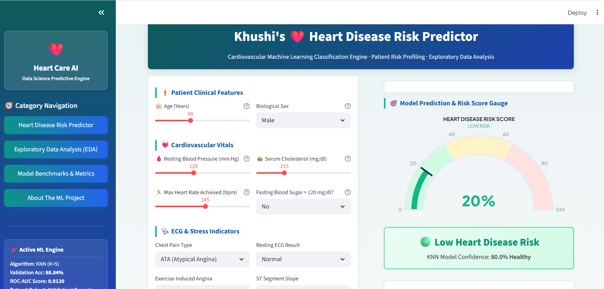

# ❤️ Khushi's Heart Care AI


A **Machine Learning + Data Science** web app that predicts cardiovascular (heart disease) risk from patient health indicators, built with **Streamlit**, **Scikit-Learn (KNN Classifier)**, and **Plotly**.

**Risk Classes:** Low Risk 🟢 · High Risk 🔴

🔗 **Live Demo:** https://heart-care-ai-by-khushi.streamlit.app/

---

## 📑 Table of Contents

- [About the Project](#-about-the-project)
- [Project Workflow](#-project-workflow)
- [Dataset](#-dataset)
- [Live Features](#-live-features)
- [Machine Learning Model](#-machine-learning-model)
- [Application Preview](#️-application-preview)
- [How to Use](#-how-to-use)
- [Tech Stack](#️-tech-stack)
- [Setup](#-setup)
- [Project Structure](#-project-structure)
- [Future Improvements](#-future-improvements)
- [Developer](#-developer)

---

## 📖 About the Project

- Predicts the risk of heart disease from 11 clinical patient features using classical Machine Learning (no deep learning).
- Trained and evaluated a **K-Nearest Neighbors (KNN) Classifier**, tuned across multiple K values to find the best validation accuracy.
- Full feature preprocessing pipeline — categorical encoding + `StandardScaler` — saved and reused at inference time for consistent predictions.
- Packaged as a complete interactive Streamlit application — risk predictor, EDA explorer, and model benchmark dashboard — not just a Jupyter notebook.
- Built with a strong focus on **explainability**: every prediction comes with confidence scores, a feature radar, and a what-if simulator so users understand *why* a result was given, not just *what* it is.

---

## 🔄 Project Workflow

1. **Input** — patient details entered via an interactive form (age, sex, chest pain type, blood pressure, cholesterol, fasting blood sugar, ECG results, max heart rate, exercise angina, oldpeak, ST slope)
2. **Preprocessing** — categorical features encoded and reordered to exactly match the training feature columns (`columns.pkl`)
3. **Scaling** — numeric feature values transformed using a fitted `StandardScaler` (`scaler.pkl`), same as during training
4. **Classification** — the trained KNN model (`KNN_heart.pkl`, K=5) predicts Heart Disease risk (0 = Healthy, 1 = At Risk)
5. **Output** — risk label with probability/confidence score, a patient feature radar chart, live what-if simulation, and a downloadable report (HTML/CSV)

---

## 📊 Dataset

- **File:** `heart.csv`
- **Size:** 918 patient records
- **Target values (2 classes):**

  | Label | Result |
  |---|---|
  | 0 | Healthy |
  | 1 | Heart Disease Risk |

- **Features used:**

  | Feature | Description |
  |---|---|
  | Age | Patient's age in years |
  | Sex | Male / Female |
  | ChestPainType | Type of chest pain (ATA, NAP, ASY, TA) |
  | RestingBP | Resting blood pressure (mm Hg) |
  | Cholesterol | Serum cholesterol (mg/dl) |
  | FastingBS | Fasting blood sugar > 120 mg/dl (1 = yes, 0 = no) |
  | RestingECG | Resting electrocardiogram results |
  | MaxHR | Maximum heart rate achieved |
  | ExerciseAngina | Exercise-induced angina (Y/N) |
  | Oldpeak | ST depression induced by exercise |
  | ST_Slope | Slope of the peak exercise ST segment |

---

## ⚡ Live Features

- 🔮 **Interactive Risk Predictor** — fill in patient details and get an instant heart disease risk prediction
- 🕸️ **Patient Feature Radar** — visual comparison of the entered patient's profile against the overall dataset population
- 🎛️ **What-If Scenario Simulator** — tweak any feature and watch the risk score recalculate in real time
- 💡 **Insights & Reports** — clinical insights with downloadable, printable HTML and CSV prediction reports
- 📊 **EDA Explorer** — interactive exploratory data analysis with attribute-level filters and charts
- 📈 **Model Benchmarks Dashboard** — confusion matrix, ROC curve, and feature importance visualizations
- 🎛️ **KNN Hyperparameter Tuner** — interactively change K and see validation accuracy shift live
- 🕓 **Session History** — track past predictions made during the session, shown in the sidebar

---

## 🧠 Machine Learning Model

| K (Neighbors) | Validation Accuracy |
|---|---|
| 3 | 86.4% |
| **5** ✅ | **88.04%** |
| 7 | 87.5% |
| 9 | 86.9% |

**Final model:** KNN Classifier (K=5) — 88.04% validation accuracy, 0.912 ROC-AUC.

**Why KNN?**
- Simple, interpretable, and well-suited to this dataset's size (918 records)
- No heavy training cost — easy to retrain as new data comes in
- Performed on par with (or better than) other baseline classifiers tested during experimentation

---

## 🖼️ Application Preview



> Add a screenshot of your running app here — save it as `screenshot.png` in the project root, and it will automatically render above once pushed to GitHub.

---

## 🎮 How to Use

1. Run the app → opens in your browser
2. **Heart Disease Risk Predictor tab** — fill in patient details → click Predict
3. **Radar & Cohort View** — see the patient's feature profile plotted against the dataset population
4. **What-If Simulator** — tweak individual features to see how risk changes in real time
5. **Insights & Report tab** — download the HTML or CSV prediction report
6. **EDA tab** — explore and filter the underlying patient dataset
7. **Model Benchmarks tab** — view confusion matrix, ROC curve, and feature importance

---

## 🛠️ Tech Stack

- **Streamlit** — web app framework
- **scikit-learn** — KNN Classifier, StandardScaler
- **Pandas & NumPy** — data handling
- **Plotly** — interactive charts (radar, ROC curve, confusion matrix)
- **Joblib** — model & scaler serialization

---

## 🚀 Setup

```bash
git clone https://github.com/Khushi18Singh/Heart-Care-Ai.git
cd Heart-Care-Ai
python -m venv venv
venv\Scripts\activate      # Windows
source venv/bin/activate   # Mac/Linux
pip install -r requirements.txt
streamlit run app.py
```

---

## 📂 Project Structure

```
├── app.py               # Main Streamlit application
├── heart.csv             # Training dataset
├── KNN_heart.pkl          # Trained KNN classifier
├── scaler.pkl             # Fitted StandardScaler
├── columns.pkl            # Feature column order used by the model
├── requirements.txt       # Python dependencies
├── .gitignore
└── README.md
```

---

## 🔮 Future Improvements

- Try ensemble models (Random Forest, XGBoost) for higher accuracy
- Add SHAP/LIME-based explainability for individual predictions
- Persistent history (database-backed, not session-only)
- Deploy on Streamlit Cloud / Docker
- Add user authentication for multi-patient tracking
- Add unit tests for the preprocessing and prediction pipeline

---

## ⚕️ Disclaimer

This project is built strictly for **educational and Data Science demonstration purposes**. It is **not** a substitute for professional medical advice, diagnosis, or treatment. Always consult a certified physician for medical concerns.

---

## 👩‍💻 Developer

**Khushi Singh** — Machine Learning & AI Engineer
